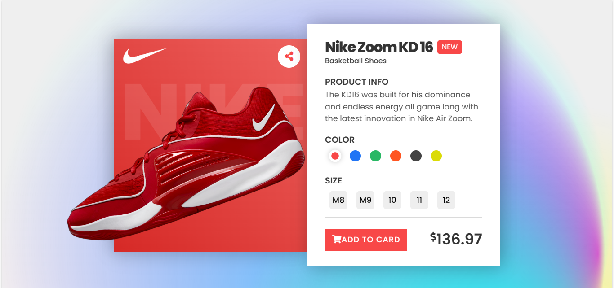

  

  <h2 align="center">Nike</h2>
  

  <!-- to modify -->
    <a href="https://www.nike.com/"><strong>Nike's Official website</strong></a>
     
     
    <a href="https://johanlib.github.io/Nike-Zoom-KD16/">View Demo</a>
    ·
    <a href="https://github.com/johanLib/Nike-Zoom-KD16/issues" target="_blank">Report Bug</a>
    ·
    <a href="https://github.com/johanLib/Nike-Zoom-KD16/issues" target="_blank">Request Feature</a>
  

<!-- Bagdes -->

  <!-- Profile -->
  
  <!-- Tools -->
  
  
  
  

#

 

## Table of contents

- [Overview](#overview)
- [Features](#Features)
  - [Built With](#built-with)
- [Getting Started](#getting-started)
  - [NPM Scripts](#npm-scripts)
  - [Installation](#installation)
  - [Usage](#usage)
- [Author](#author)
  - [Contact](#contact)

## overview

This web application is dedicated to showcasing the exquisite Nike Zoom KD16 basketball shoes. Users can explore various options, including different colors and sizes, and get detailed information about this specific product.

## features

Variety of Colors: The application displays the Nike Zoom KD16 in red, green, yellow, black, orange, and blue.
Size Options: Users can select their perfect fit from a range of sizes available.
Product Information: Concise yet comprehensive details about the Nike Zoom KD16 are provided to inform users about its features and benefits.

## built-with

HTML
Tailwind CSS
JavaScript

## getting-started

To get a local copy up and running follow these simple steps.

### NPM Scripts

This is an example of how to list things you need to use the software and how to install them.

npm
npm install npm@latest -g 

## installation

Clone the repo
git clone [1](https://github.com/johanLib/Nike-Zoom-KD16.git)

Install NPM packages
npm install

## usage

Explore different colors options by clicking on color buttons displayed on screen; size options are also available for selection before adding item into cart.

## author

- GitHub - [@seghiranas](https://github.com/johanLib)

## contact

Anass - @email - seghiranas3@gmail.com
